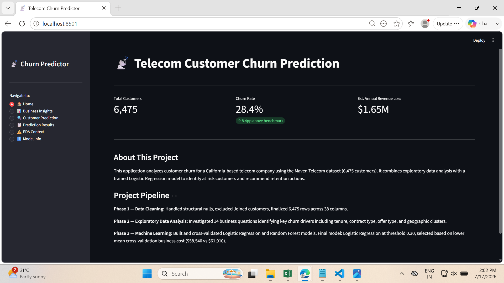
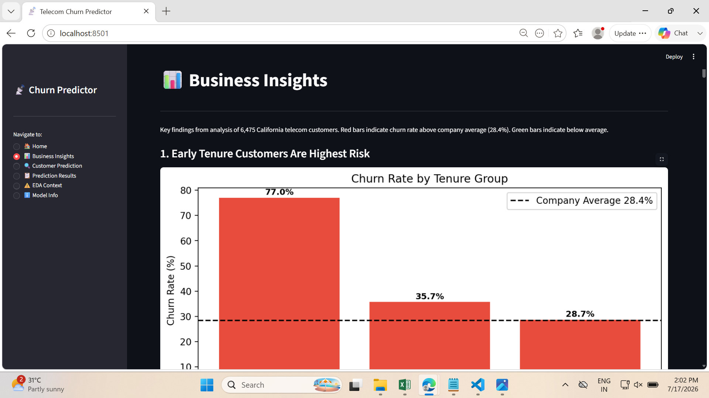
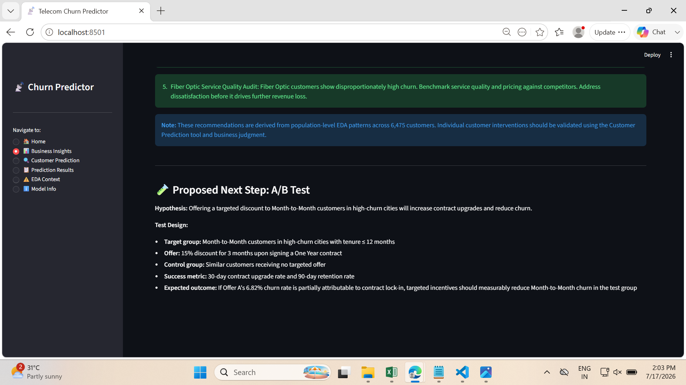
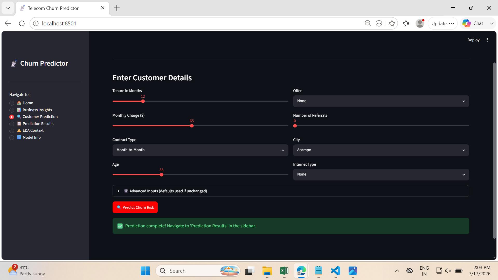
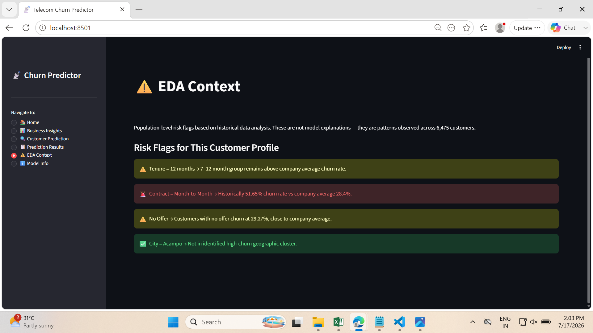
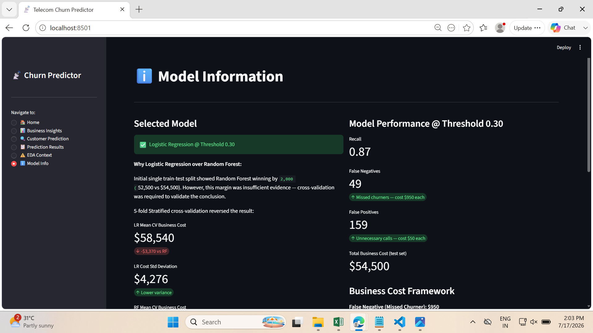

# Customer Churn Prediction — Maven Telecom (California)

Predicting customer churn for a California telecom provider using classification models, custom business-cost optimization, and an interactive Streamlit app.

## 🔗 Live Demo

**Try the deployed application here:**

🚀 **[Launch the App](https://customer-churn-prediction-ufjxhbtt8ihbdde986vfuy.streamlit.app/)**

No installation required — open the link and start exploring the dashboard.

## Business Problem

Telecom companies lose significantly more money failing to catch a customer who *will* churn than they lose by flagging a customer who *won't* (retention offers are cheap; lost customers are expensive). This project builds a churn prediction model that is optimized for that real cost asymmetry — not just for accuracy.

- **Dataset:** Maven Telecom Customer Churn — 7,043 customers, California, 38 features
- **Overall churn rate:** 28.4% (8.4 points above the 20% industry benchmark)
- **Estimated annualized revenue at risk:** ~$1.65M

## Project Workflow

```text
Raw Data (7,043 customers, 38 features)
        │
        ▼
Data Cleaning
        └── Drop corrupted rows, handle structural nulls, define target
        │
        ▼
Exploratory Data Analysis
        └── 14 business questions answered
        │
        ▼
Feature Engineering
        └── High_Churn_City flag, encoding, multicollinearity checks
        │
        ▼
Modeling
        └── Logistic Regression vs. Random Forest
        │
        ▼
Business Cost Optimization
        └── $950 FN / $50 FP → Threshold tuned from 0.50 to 0.30
        │
        ▼
Validation
        └── 5-fold Stratified K-Fold Cross-Validation
        │
        ▼
Deployment
        └── Streamlit app with live prediction, insights, and model info
```

## App Preview

The application provides an end-to-end workflow, from customer prediction to business recommendations and model interpretation.

### Home

Shows project overview, dataset summary, and pipeline.



---

### Business Insights

Interactive dashboard highlighting the most important churn patterns discovered during EDA.



---

### Customer Prediction

Users can enter customer information and generate a live churn prediction.



---

### Prediction Results

Displays churn probability, risk level, business impact, and recommended actions.



---

### EDA Context

Explains which historical business patterns apply to the selected customer profile.



---

### Model Information

Summarizes model selection, performance metrics, threshold optimization, and cross-validation results.



## Key EDA Findings

- **Early tenure risk:** 77.01% of churn happens in the first 0–6 months — 48.61 points above benchmark. Strongest actionable signal in the dataset.
- **Contract type dominates:** Month-to-Month churn is 51.65% vs. 2.62% for Two-Year contracts.
- **Competitor-driven churn:** 45.2% of churn is attributed to competitors, concentrated geographically (San Diego cluster: 66.42% churn, 82.8% competitor-attributed).
- **Protective services matter:** Each additional protective service (device protection, security, etc.) is associated with a monotonic reduction in churn, totaling a 58.22-point spread.
- **Monthly charges are non-monotonic:** Churn peaks at the 3rd charge quartile and *dips* at the 4th. This is driven by contract-length and tenure composition within that quartile, not by customers being more price-sensitive at higher charges — a correlation vs. causation trap worth flagging explicitly.
- **Streaming services confound:** Streaming service churn signal is largely explained by its overlap with Fiber Optic customers, not an independent driver.
- **Offer E anomaly:** Customers on Offer E churn at 67.91%, far above other offers — flagged as a targeting/segment issue worth business follow-up.

## Modeling Approach

Two models were built and evaluated: **Logistic Regression** and **Random Forest**.

### Custom business cost framework
Rather than optimizing for accuracy or a generic F1 score, a cost matrix was built around real business impact:
- **False Negative (missed churner):** $950 — lost customer lifetime revenue
- **False Positive (unnecessary retention offer):** $50 — cost of an offer to a customer who'd have stayed

This ~19:1 cost asymmetry justified moving the classification **threshold from 0.50 down to 0.30**, catching more true churners at the cost of more false alarms — the correct trade given the cost imbalance.

### Why Logistic Regression was chosen over Random Forest
A single train/test split initially favored Random Forest ($52,500 total cost vs. Logistic Regression's higher figure). But a single split can be misleading — so this was checked with **5-fold Stratified K-Fold cross-validation**:

| Model | Avg. Cost (5-fold CV) | Folds Won |
|---|---|---|
| Logistic Regression | $58,540 | 4 / 5 |
| Random Forest | $61,910 | 1 / 5 |

The single-split result favoring Random Forest turned out to be an atypically favorable split, not a representative one. **Logistic Regression at threshold 0.30 was selected as the final model** based on the cross-validated result, not the single split — a deliberate choice to trust the more rigorous evidence over the more convenient one.

### Preprocessing notes
- `StandardScaler` was fit **only on the training set** and applied to test data, to avoid data leakage.
- A `High_Churn_City` binary feature was engineered from cities with churn rate >20% and n≥30, to avoid noisy small-sample cities skewing the flag.

## Streamlit App

An interactive app was built to make the model usable by a non-technical stakeholder:

- **Home** — project overview
- **Business Insights** — key EDA findings and revenue-at-risk framing
- **Customer Prediction** — input a customer's profile, get a live churn prediction
- **Prediction Results** — probability, threshold-adjusted decision, and recommended action
- **EDA Context** — supporting visuals for the prediction
- **Model Info** — model choice, metrics, and the cost-based rationale above

The app loads 4 serialized artifacts (`model.pkl`, `scaler.pkl`, `feature_columns.pkl`, `high_churn_cities.pkl`) and reconstructs the full 33-feature encoding pipeline used in training, with `st.session_state` used to pass prediction data between pages.

## Repository Structure

```
├── app/
│   └── app.py                  # Streamlit application
├── data/
│   ├── raw/                    # Original Maven Telecom dataset
│   └── processed/              # Cleaned dataset used for modeling
├── models/
│   ├── model.pkl                # Trained Logistic Regression model
│   ├── scaler.pkl                # Fitted StandardScaler
│   ├── feature_columns.pkl       # Column order/encoding reference
│   └── high_churn_cities.pkl     # Engineered city-risk flag lookup
├── notebooks/
│   ├── 01_data_cleaning.ipynb
│   ├── 02_eda.ipynb
│   └── 03_modeling.ipynb
├── requirements.txt
└── README.md
```

## Tools & Stack

Python · Pandas · NumPy · Scikit-learn · Matplotlib · Seaborn · Streamlit · SQL · Power BI

## How to Run

```bash
# Clone the repository
git clone https://github.com/arpita920/Customer-Churn-Prediction.git

# Navigate to the project directory
cd Customer-Churn-Prediction

# Create a virtual environment
python -m venv venv

# Activate the virtual environment
# Windows
venv\Scripts\activate

# macOS/Linux
# source venv/bin/activate

# Install dependencies
pip install -r requirements.txt

# Run the Streamlit app
streamlit run app/app.py
```

## Limitations & Future Work

- Dataset is limited to California customers; generalizability to other regions is untested.
- The retention-cost assumption (average tenure of a retained customer) is based on partial calculation and is being finalized for full defensibility.
- A/B testing framework proposed for validating the retention-offer strategy in production, not yet implemented.

## Author

**Arpita Rathi**

- BTech. Electrical Engineering, SGSITS Indore (2027)
- GitHub: https://github.com/arpita920
